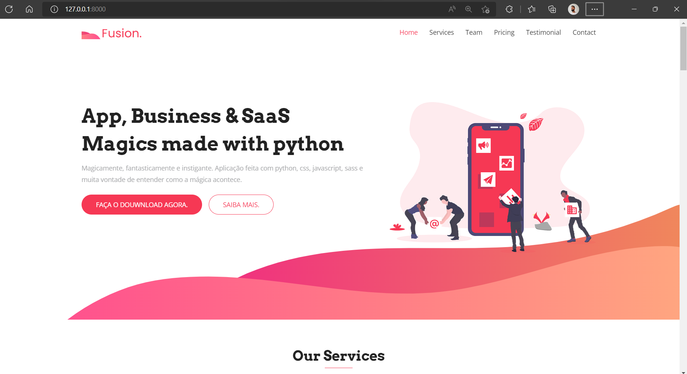

# Fusion App

<p align="center">
  <a href="https://github.com/WellingtonFidelis">
    
  </a>

  

  

  
</p>

<p align="center">
  
</p>

# :pushpin: Tabela de conteúdos

* [Sobre o projeto](#satisfied-sobre-o-projeto)
* [Layout](#panda_face-layout)
* [Tecnologias](#snowflake-tecnologias)
* [Como rodar o projeto](#question-como-rodar-o-projeto)
* [Autor](#closed_book-autor)

---
# :satisfied: Sobre o projeto
This project is part of course from [Udemy with Geek University](<https://www.udemy.com/course/programacao-web-com-django-framework-do-basico-ao-avancado/>).

---
# :panda_face: Layout
* [Bootstrap](https://getbootstrap.com/)

---
# :snowflake: Tecnologias
* [Python](https://www.python.org/)
* [Django](https://www.djangoproject.com/)

---
# :question: Como rodar o projeto
## Acessando direto pelo site:
* Ainda não consegui deixar online. =/

## Rodando na máquina local:
1. Abra o terminal na pasta desejada para clonar o repositório e execute o comando:
``` bash
git clone https://github.com/WellingtonFidelis/python-projects.git
```
2. Depois de concluído, execute os seguintes comandos para seguir para o caminho do app:
``` bash
cd python-projects/fusion-app
```
3. Para criar um ambiente virtual dedicado para o app:
``` bash
python -m venv ./venv
```
4. Ativar o ambiente virtual
  1. No Windows OS
``` bash
./venv/Scripts/activate
```
  2. No Linux OS
``` bash
./venv/bin/activate
```
5. Para iniciar o servidor local:
``` bash
python manage.py runserver
```
6. Acessando o web app, abra o navegador e digite:
* http://localhost:8000/

---
## Mais algumas imagens
<p align="center">
  
  
  
</p>

---
# :closed_book: Autor
Feito por [Wellington Fidelis](https://github.com/WellingtonFidelis).
### :octocat: Github: https://github.com/WellingtonFidelis
### :link: LinkedIn: https://www.linkedin.com/in/wellington-fidelis-7b02b167/
### :camera: Instagram: https://www.instagram.com/wellingtonfidelis/
